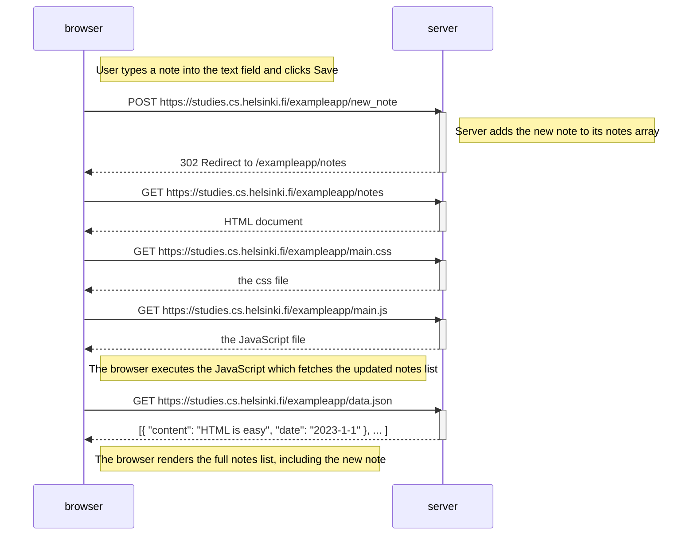
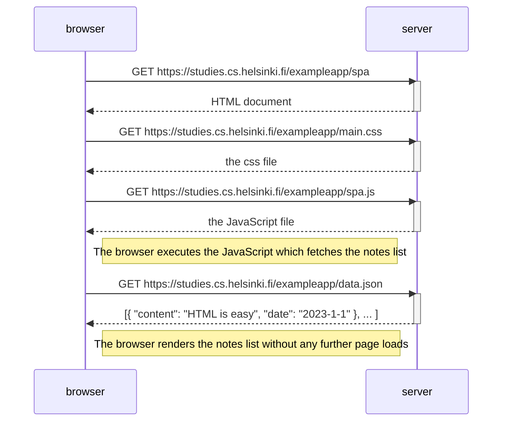
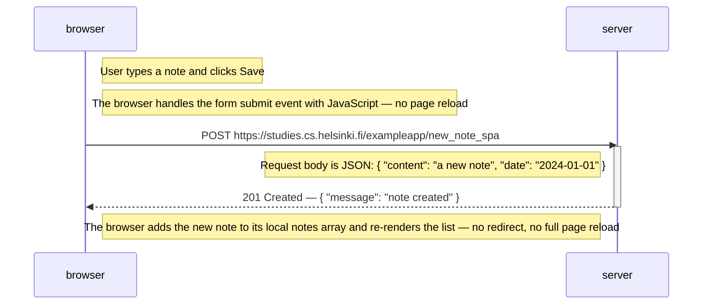

# Part 0 Exercises

## Exercise 0.4 – New note diagram

Depicts the sequence of events when a user writes a note and clicks **Save** on:
`https://studies.cs.helsinki.fi/exampleapp/notes`

---

## Exercise 0.5 – Single page app diagram

Depicts the sequence of events when a user opens the SPA version of the notes app at:
`https://studies.cs.helsinki.fi/exampleapp/spa`

---

## Exercise 0.6 – New note in Single page app diagram

Depicts the sequence of events when a user creates a new note using the SPA version of the app.

